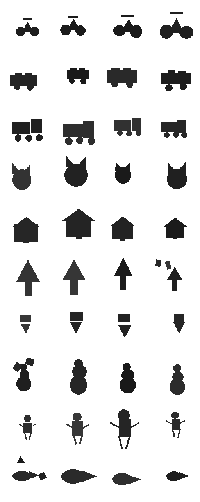

# Shape-primitive object recognition

Does recognising objects from **generic geometric primitives and their
spatial relations** generalise better than an end-to-end CNN?

```
pixels ──► primitive extractor ──► graph of shapes ──► relational classifier ──► class
           oracle | classical |       type, size, pose,    GNN | set transformer |
           learned | SAM-fit |        pairwise relations   bag ablation
           stroke fit
```

The plan is in [`PLAN.md`](PLAN.md): three phases, each harder than the
last. [`docs/research_plan.md`](docs/research_plan.md) turns it into
falsifiable predictions. The four hypotheses are:
- **H1**, sample efficiency;
- **H2**, relations matter;
- **H3**, viewpoint robustness;
- **H4**, appearance robustness.

The pixel baseline is deliberately strong: ResNet-18 from scratch, with and
without augmentation, plus an ImageNet fine-tune and a frozen ImageNet
linear probe. A win measured against a weak baseline would not mean
anything.

## Contents

- [Status](#status)
- [Results so far](#results-so-far)
- [Quick start](#quick-start)
  - [Data](#data)
- [Repository layout](#repository-layout)
- [Experimental protocol](#experimental-protocol)
- [Decisions and fixes along the way](#decisions-and-fixes-along-the-way)
- [Further reading](#further-reading)

## Status

| Step | What | Status |
|---|---|---|
| 1 | Shared components: bag ablation, set transformer, pretrained CNNs, held-out composition variants | merged (#4) |
| 2 | **Phase 1**: clean 2D drawings | merged (#8), [results](results/phase1/SUMMARY.md) |
| 3 | Phase 2–3 code: viewpoint transforms, extractors, textures, QuickDraw, SAM-fit, resumable queue | merged (#7) |
| 4 | **Phase 2**: viewpoint (rotation, shear, perspective) | merged (#9), [results](results/phase2/SUMMARY.md) |
| 5 | **Phase 3a**: textures, colours, clutter, occlusion | half done: flat→textured complete, textured→flat 1/18 runs |
| 6 | **Phase 3b**: QuickDraw sketches | implemented, smoke-tested, not run |
| 7 | **Phase 3c**: real photos, model-vs-human sets, final cross-phase figure | implemented and smoke-tested (figure script to write), not run |

**Resuming:** the remaining work, how to resume, and the open caveats
are in [`docs/continuation_plan.md`](docs/continuation_plan.md).

CI runs the test suite on every push and pull request
(`.github/workflows/tests.yml`).

## Results so far

All numbers are 3 seeds, mean ± 95% CI, at 64 px. "Oracle" means the graph
model gets the generator's own primitives, so it measures the
representation alone.

**Phase 1: clean drawings** ([full results](results/phase1/SUMMARY.md)).

| Test | Oracle graph model | Best pixel model | Verdict |
|---|---|---|---|
| Few-shot, 5 examples/class | 0.999 | 0.999–1.000 (augmented / ImageNet) | tie; only the un-augmented CNN (0.55) loses |
| Position/scale shift | **1.000** | 0.936 | primitives win (invariant by construction) |
| Novel part compositions | 0.49 (max pool 0.70; set transformer 0.86) | **0.98** | pixels win: the GNN learns a part-*type* shortcut |
| Tree vs arrow sign (same parts, flipped) | 1.000 | 1.000 | tie; the bag ablation is at chance (0.50), so relations are needed |

**Phase 2: viewpoint** ([full results](results/phase2/SUMMARY.md)).
Trained on viewing angles 0–30°, the oracle GNN with an affine-normalised
graph still scores **0.996 at 60–70°**; every pixel model falls to
0.38–0.60. Under viewpoint change it is also more sample-efficient: 1.000
against 0.960 at 5 examples/class. The advantage is lost in extraction:
- classical extractor: 0.62;
- learned detector: 0.13, because its F1 falls from 1.0 to 0.16 past 50°.

**Phase 3a: appearance** (flat → textured, 150/class; write-up pending).

| Model, trained on flat drawings | Texture | Unseen colours | Clutter | Occlusion | Noise + blur | All combined |
|---|---|---|---|---|---|---|
| **GNN on the appearance-trained detector** | **1.00** | **0.97** | **0.99** | **0.93** | **1.00** | **0.83** |
| GNN (classical extractor) | 0.99 | 0.99 | 0.27 | 0.47 | 0.46 | 0.14 |
| ImageNet probe | 0.94 | 0.96 | 0.55 | 0.70 | 0.89 | 0.28 |
| CNN (from scratch; augmented variants are no better except colour aug on noise + blur, 1.00) | 0.93 | 0.71 | 0.25 | 0.71 | 0.84 | 0.15 |

The detector is class-agnostic: it was trained on appearance-randomised
images with primitive labels only, and never saw a class label or the
unseen colours. It relocates the appearance problem out of the classifier,
as the research plan predicted. Caveat: the flat-trained CNNs never saw
textured or cluttered images at all. The reverse experiment, now running,
gives the pixel side that data.

## Quick start

```bash
scripts/setup_env.sh            # CPU PyTorch + package + extras, then runs the tests
scripts/setup_env.sh --data     # ... and fetches the Phase 3b/3c data

# or by hand (Python 3.10+; the CPU build of PyTorch is enough)
pip install torch torchvision --index-url https://download.pytorch.org/whl/cpu
pip install -e ".[dev,real]"    # "real" = transformers, for SAM-fit (Phase 3c)
python -m pytest -q             # ~230 tests, also run in CI

# one experiment
python scripts/run_experiment.py --config configs/phase1/learning_curve.yaml --resume
python scripts/plot_results.py --summary results/phase1/learning_curve/summary.json

# everything remaining in PLAN.md, one job at a time, resumable
scripts/run_all.sh
```

`scripts/run_all.sh` runs every experiment in order:
- it skips runs whose `metrics.json` already exists;
- it trains the learned detectors only if their weights are missing;
- it fetches the Phase 3 data if absent;
- it commits and pushes `results/` every 15 minutes and after each step, so
  a reclaimed machine loses at most one in-progress run.

It never runs two training jobs at once: parallel PyTorch jobs on the same
cores oversubscribed the thread pools and ran ~10× slower each.

`run_experiment.py` flags: `--dry-run`, `--resume`, `--models ...`,
`--seeds ...`, `--device cpu|cuda|auto`.

### Data

Phases 1–3a are generated on the fly and need no downloads. Phases 3b–3c
fetch public data into `data/` (not committed):

| Script | Fetches |
|---|---|
| `scripts/fetch_quickdraw.py` | first ~3 MB of 10 Quick, Draw! classes (simplified strokes) |
| `scripts/fetch_real_data.py` | COCO 2017 annotations and crops (bicycle, car, truck, cat), plus Geirhos's model-vs-human sketch / stylized / edge / silhouette / cue-conflict sets |

## Repository layout

```
src/shapeprim/
  data/     primitives.py      primitive dataclass, rendering, polygon pose
            objects.py         10 class templates + held-out composition variants
            synth_dataset.py   deterministic generator; GenerationConfig holds every dial
            transforms.py      Phase 2: rotation, shear, squash, perspective (on the geometry)
            textures.py        Phase 3a: textures, seen/unseen palettes, clutter, occlusion, noise, blur
            real.py            Phase 3b/3c: QuickDraw, COCO crops, model-vs-human sets
            augment.py         CNN augmentation presets (standard, strong, view, appearance, ...)
            torch_datasets.py  image / graph datasets, extraction cache
  extract/  oracle.py          ground-truth primitives
            classical.py       OpenCV extractors (v1 for Phase 1, v2 with ellipses/quads)
            learned.py         small CenterNet-style detector, class-agnostic
            strokes.py         sketch strokes -> primitives
            sam_fit.py         SAM masks -> best-fitting primitive (SlimSAM-77)
            eval_match.py      IoU matching -> precision / recall / F1
  graph/    build.py           primitives -> graph; bbox frame or affine-whitened frame
  models/   cnn.py             ResNet-18: scratch, ImageNet fine-tune, linear probe
            gnn.py             GINE-style GNN; mean / max / attention pooling
            settransformer.py  attention over primitives
            bag.py             ablation: per-type counts and sizes only
  train.py  shared loop: validation selection, step floor, precise BN
  evaluate.py, experiment.py, conditions.py
configs/    model/*.yaml and phase1|2|3/*.yaml: every experiment is a config
scripts/    run_experiment.py  one experiment (models x sizes x seeds, shifts, named test sets)
            run_all.sh         the whole remaining plan, resumable
            plot_results.py    tables + learning-curve / shift figures
            plot_conditions.py accuracy vs a binned condition (angle, rotation)
            plot_named_tests.py accuracy on named conditions (appearance, real-image OOD sets)
            setup_env.sh       fresh-machine setup
            train_learned_extractor.py, precompute_sam.py, eval_classical.py,
            eval_strokefit.py, supersede_short_runs.py, fetch_*.py
results/    <phase>/<experiment>/: summary.json, results.md, figures, one directory per run
            <phase>/SUMMARY.md: the write-up and done-when check for each phase
docs/       experiment_protocol.md, research_plan.md, literature_review.md
```

## Experimental protocol

The full protocol is in [`docs/experiment_protocol.md`](docs/experiment_protocol.md).

- **Splits:** train, validation and test come from disjoint random streams.
  Model selection uses validation only; the test set is touched once per
  run. Under a shift, validation follows the *training* distribution.
- **Seeds:** at least 3, reported as mean ± Student-t 95% CI.
- **Same treatment for every model:**
  - the same schedule;
  - at least 500 optimizer steps, with no early stopping before them (rule 3b);
  - precise BatchNorm, i.e. statistics re-estimated on training data before
    every validation pass (rule 3c);
  - at most ~60 validation passes per run (rule 3d).
- **Augmentation:** the pixel baselines are reported with and without it,
  including augmentation matched to each shift.
- **Extractor quality:** precision/recall/F1 is reported next to every
  graph-model accuracy that has ground truth.
- **Records:** every run commits its config, git commit, seed, metrics and
  per-sample predictions.

## Decisions and fixes along the way

Each of these changed results. Each is documented where it applies, and
the superseded runs are kept, not deleted.

| What | Why | Where |
|---|---|---|
| `arrow_sign` made the exact vertical flip of `tree` (dataset v2) | the bag ablation separated the v1 pair by part sizes alone, so it was not a relation twin | `data/objects.py`, PR #4 |
| 500-step training floor | early stopping ended augmented CNNs after ~130 steps | protocol 3b, `results/phase1/superseded_patience8/` |
| Precise BatchNorm | stale BN statistics made augmented ResNets swing between 0.10 and 1.00 validation accuracy | protocol 3c, `results/phase1/superseded_no_precise_bn/` |
| Validation capped at ~60 passes | the step floor made small-n runs spend 10× their training time validating | protocol 3d |
| Phase 1 gate recorded as partly met; proceed | the hypothesis failing on few-shot is itself the result (pre-registered in the research plan §6) | `results/phase1/SUMMARY.md` |
| Appearance detector retrained with per-image randomised clutter/noise/blur | the first version saw clutter on every image and failed on white backgrounds (F1 0.47) | `results/phase3/superseded_clutter_always/` |
| SlimSAM-77 instead of SAM ViT-B | ViT-B took ~130 s per image on the 4-core CPU | `extract/sam_fit.py` |
| Default branch used as `main` | the repository has no `main`; PRs merge into `claude/synthetic-images-jwnilo` | — |

Methodology questions along the way (the twin fix, the training floor,
the Phase 1 gate) were settled with an independent review agent before
acting. Its reasoning is summarised in the PR descriptions.

## Further reading

- [`PLAN.md`](PLAN.md): the phased project plan.
- [`docs/research_plan.md`](docs/research_plan.md): from "it works" to a
  publishable, falsifiable claim.
- [`docs/literature_review.md`](docs/literature_review.md): positioning
  against part-based, neuro-symbolic and sketch-graph work.
- [`docs/experiment_protocol.md`](docs/experiment_protocol.md): how every
  number here was produced.
- [`docs/continuation_plan.md`](docs/continuation_plan.md): what remains
  and how to pick it up.


